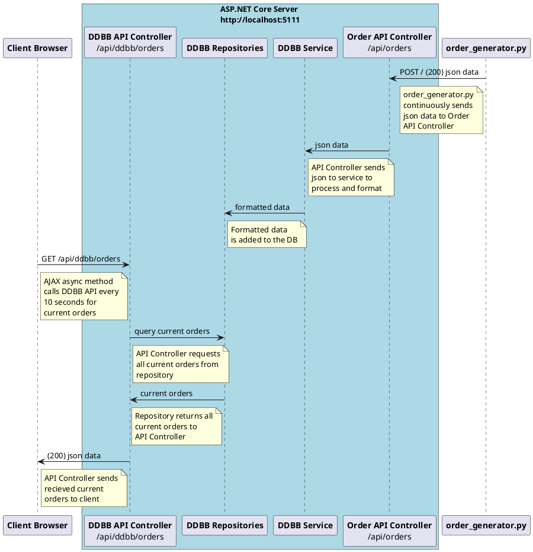

```plantuml
@startuml
participant "**Client Browser**" as CB
box "ASP.NET Core Server\nhttp://localhost:5111" #LightBlue
participant "**DDBB API Controller**\n/api/ddbb/orders" as DAC
participant "**DDBB Repositories**" as R
participant "**DDBB Service**" as S
participant "**Order API Controller**\n/api/orders" as OAC
end box
participant "**order_generator.py**" as OG
OG -> OAC: POST / (200) json data
Note left of OG: order_generator.py\ncontinuously sends\njson data to Order\nAPI Controller
OAC -> S: json data
Note right of S: API Controller sends\njson to service to\nprocess and format
S -> R: formatted data
Note right of R: Formatted data\nis added to the DB
CB -> DAC: GET /api/ddbb/orders
Note right of CB: AJAX async method\ncalls DDBB API every\n10 seconds for\ncurrent orders
DAC -> R: query current orders
Note right of DAC: API Controller requests\nall current orders from\nrepository
R -> DAC: current orders
Note left of R: Repository returns all\ncurrent orders to\nAPI Controller
DAC -> CB: (200) json data
Note left of DAC: API Controller sends\nrecieved current\norders to client
@enduml
```